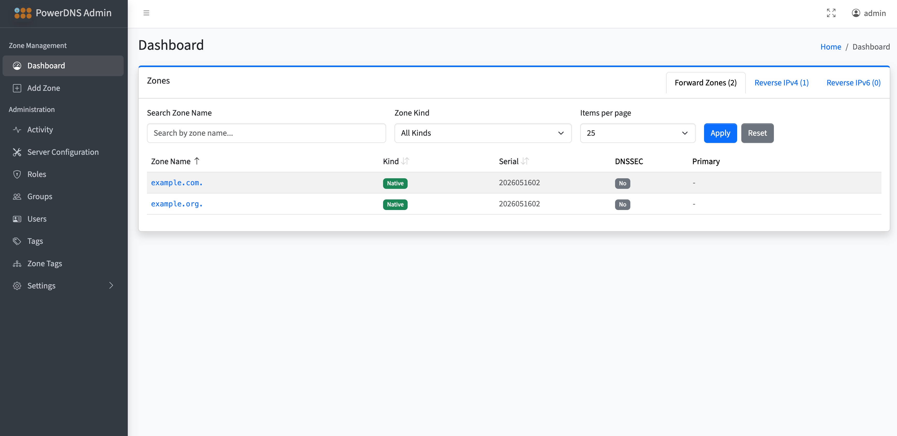

# GoPowerDNS-Admin

[](https://github.com/GoPowerDNS-Admin/GoPowerDNS-Admin/releases)
[](LICENSE)
[](https://github.com/GoPowerDNS-Admin/GoPowerDNS-Admin/pkgs/container/gopowerdns-admin)
[](https://demo.gopowerdnsadmin.org/login)
[](https://buymeacoffee.com/chrisamti)

---

GoPowerDNS-Admin is a modern, web-based administration UI for PowerDNS, written in Go. Manage forward and reverse zones and their records, configure your PowerDNS server, and authenticate via local accounts, OIDC, or LDAP — all from a single, self-contained binary with no runtime dependencies.

[](https://demo.gopowerdnsadmin.org/login)

> **[▶ Try the live demo](#live-demo)** — no install required.

## Why GoPowerDNS-Admin?

A lightweight, easy-to-deploy alternative to the original Python [PowerDNS-Admin](https://github.com/PowerDNS-Admin/PowerDNS-Admin), rebuilt in Go with a focus on simple operation:

- **Single static binary** — no Python runtime, virtualenv, or system packages to manage. Drop in one file (or one container) and run.
- **Pure-Go SQLite** — run with zero external database (no CGO, no C toolchain), or connect MySQL/MariaDB or PostgreSQL when you need it.
- **Runs anywhere** — prebuilt binaries and multi-arch container images for amd64, arm64, and armv7 (happy on a Raspberry Pi).
- **Modern UI** — AdminLTE 4 / Bootstrap 5 with reactive Alpine.js components.
- **Batteries included** — RBAC, OIDC/LDAP/TOTP auth, an audit log with undo, auto-PTR, and DNSSEC-aware editing.
- **Actively maintained** — regular tagged releases and a live, daily-reset demo.

|                      | GoPowerDNS-Admin                          | PowerDNS-Admin (Python)         |
| -------------------- | ----------------------------------------- | ------------------------------- |
| Built with           | Go                                        | Python / Flask                  |
| Deployment artifact  | Single self-contained binary or container | Python environment or container |
| Zero-config local DB | Pure-Go SQLite (no CGO / C toolchain)     | SQLite via Python               |

## Documentation

**[https://docs.gopowerdnsadmin.org](https://docs.gopowerdnsadmin.org)**

## Live Demo

**[https://demo.gopowerdnsadmin.org/login](https://demo.gopowerdnsadmin.org/login)**

| Role  | Username | Password   |
| ----- | -------- | ---------- |
| Admin | `admin`  | `changeme` |
| User  | `user`   | `password` |

The demo resets automatically every day at midnight UTC. Feel free to create zones, add records, and explore the UI. A live PowerDNS instance is connected — DNS queries can be tested against `demo.gopowerdnsadmin.org` on port 53.

> **Note:** To keep the demo accessible, changing the admin password and editing your profile are disabled in demo mode.

Two sample zones (`example.com` and `example.org`) with a variety of record types, plus a reverse zone (`203.0.113.in-addr.arpa`), are pre-populated on each reset so there is something to explore immediately.

## Key Features

- Zone and record management (create, edit, and manage DNS records)
- Forward and reverse zone creation with automatic CIDR-to-zone-name conversion for IPv4 and IPv6
- Duplicate zone detection with a direct link to the existing zone
- Auto-PTR: automatically create, update, and delete PTR records in the matching reverse zone when A/AAAA records change (per-zone opt-in, disabled automatically on reverse and Slave zones)
- Cross-zone hint badges in the record list: A/AAAA records link to their PTR entry; PTR records link back to the forward record — clicking navigates to and highlights the target row
- PowerDNS server settings stored in the application database
- Multiple authentication methods:
  - Local database (with optional TOTP two-factor authentication)
  - OpenID Connect (OIDC)
  - LDAP
- TOTP two-factor authentication for local accounts (per-user opt-in, admin-enforced, or admin-disabled)
- RBAC (Role-Based Access Control) with grouped permission cards and tri-state toggles
- Zone tag-based access control
- Activity/audit log with diff tracking, detail view, and undo support (record changes and zone deletes)
- Admin-configurable TTL presets shown as a dropdown in the record modal
- DNSSEC-managed records automatically hidden from the zone editor and dashboard
- Multiple database backends: MySQL/MariaDB, PostgreSQL, SQLite (pure Go — no CGO or C toolchain required)
- Friendly AdminLTE error pages for server-side failures with contextual action buttons (e.g. direct link to PowerDNS server settings when the server is unreachable)
- Responsive web UI built on AdminLTE 4 / Bootstrap 5 with Alpine.js for reactive components
- Go backend with server-rendered templates
- Health check endpoint (`GET /health`) for load balancer and container probes
- Native TLS (manual cert/key) and automatic TLS via Let's Encrypt / ACME
- Reverse proxy support (HAProxy, nginx, Traefik) with configurable trusted IP allowlist and proxy header
- Security headers on all responses: `X-Frame-Options`, `X-Content-Type-Options`, `Content-Security-Policy`, `Referrer-Policy`, and more
- Docker image published to `ghcr.io/gopowerdns-admin/gopowerdns-admin` on each release (multi-arch: amd64, arm64, armv7)
- Release binaries for Linux (amd64, arm64, armv7), macOS (amd64, arm64), and FreeBSD (amd64, aarch64)
- Version string baked into binary, visible via `--version` / `-v` and in the UI footer

## Getting Started (Development)

Prerequisites:

- Go (see `go.mod` for the required version) — no C toolchain required; all database drivers are pure Go
- Docker and Docker Compose (optional, for local PowerDNS)

Optional contributor tooling (required only for `make linter*` / `make pre-commit`):

- [`golangci-lint`](https://golangci-lint.run/) — Go linting (`make linter`)
- [Biome](https://biomejs.dev/) — JavaScript linting for `internal/web/static/js/` (`make linter-js`); `brew install biome` or via npm
- [`pre-commit`](https://pre-commit.com/) — runs golangci-lint, biome, prettier, secret scan, go mod tidy and the conventional-commit check (`make pre-commit`)

1. Start a local PowerDNS for development (optional):

   If you want a local PDNS instance, you can use the provided compose setup:

   ```bash
   docker compose up -d
   ```

2. Configure the app:

   Review the sample configuration in `etc/main.toml` (or the copy under `internal/db/controller/setting/etc/main.toml`).
   For local testing, copy and adjust the sample into `etc/local/main.toml` — this directory is gitignored and any TOML files placed there override the settings in `etc/main.toml`:

   ```bash
   mkdir -p etc/local
   cp etc/main.toml etc/local/main.toml
   # edit etc/local/main.toml to match your local setup
   ```

   Adjust webserver, database, authentication, and record settings as needed.

3. Build and run:

   Quick run (embedded templates and static assets):

   ```bash
   go run . start
   ```

   Build with version and branch baked in:

   ```bash
   make build
   ./gopowerdns-admin start
   ```

   Development mode (templates reloaded from local filesystem on each request):

   ```bash
   go run . start --dev
   ```

   Check the version:

   ```bash
   ./gopowerdns-admin --version
   # gopowerdns-admin version v0.2.0-5-gabc1234-dirty (main)
   ```

## Project Structure (high level)

- `internal/web` — HTTP handlers, templates, static assets
- `internal/db` — models and controllers (GORM)
- `internal/powerdns` — PowerDNS API integration
- `internal/activitylog` — activity log recording and diff helpers
- `internal/config` — configuration structs
- `etc/` — example configuration
- `docker/` — Docker/Compose helpers (including PDNS and LDAP setups)

## Database Support

GoPowerDNS-Admin supports three database backends:

| Backend       | Status    | Notes                           |
| ------------- | --------- | ------------------------------- |
| MySQL/MariaDB | Supported |                                 |
| PostgreSQL    | Supported |                                 |
| SQLite        | Supported | Pure Go — no CGO or C toolchain |

Configure the backend in `etc/main.toml` under the `[DB]` section (set `GormEngine` to `mysql`, `postgres`, or `sqlite`).

## Authentication

Three authentication methods are supported and can be enabled independently:

- **Local DB** — username/password stored in the application database; supports optional TOTP (per-user or admin-enforced)
- **OIDC** — OpenID Connect (e.g. Keycloak, Authentik, Okta)
- **LDAP** — bind-based LDAP authentication

TOTP is only available for local accounts. OIDC and LDAP users rely on their identity provider for MFA. Admins can enforce TOTP per user; they can also disable it on behalf of a user (e.g. when a user loses their authenticator), unless TOTP is currently required for that account.

See `internal/config/structs.go` for available configuration fields.

## Zone Editor

The zone editor provides a full-featured DNS record management interface:

- Reactive UI powered by Alpine.js — no page reloads for record add/edit/delete
- Unified record modal for all record types with type-specific fields (MX priority, TXT chunking, DS algorithm badge)
- TXT records: monospace textarea with automatic RFC-compliant 255-byte chunking and quote handling
- Live search and per-type filter pills to quickly find records
- Apex (`@`) records sorted first within each name group
- Inline zone metadata (kind, serial, DNSSEC status) in the record list header
- Sticky records toolbar — search, the type filter, and the Add / Save / Discard actions stay pinned to the top while scrolling long record lists, so saving is always one click away
- Pagination position is preserved across **Save Changes** and **Discard** — editing a record on a later page returns you to that same page after the list reloads
- Record table scrolls horizontally on narrow screens instead of overflowing; long values (e.g. large TXT records) truncate with the full value on hover
- Collapsible zone settings card (SOA-EDIT-API, kind, masters, Auto-PTR toggle)
- DNSSEC-managed records (RRSIG, NSEC, NSEC3, DNSKEY, CDS, CDNSKEY) are automatically hidden to prevent accidental edits
- SOA record is protected — it can be viewed but not deleted or overwritten via the record modal
- Admin-configurable TTL presets available as a dropdown in the record modal (see TTL Presets below)

### Auto-PTR

When **Auto-PTR** is enabled for a forward zone (toggle in the Zone Settings card), saving A or AAAA records automatically manages the corresponding PTR record in the appropriate reverse zone:

- **Create / update** — when a new IP is added, a PTR record pointing to the record's FQDN is created (or replaced) in the most-specific matching reverse zone.
- **Delete** — when an IP is removed, its PTR record is deleted. If the PTR was manually changed to point to a different name, it is left untouched.
- **No reverse zone** — if no reverse zone exists in PowerDNS for the IP, a warning toast is shown after saving so the issue is visible.
- Auto-PTR is silently disabled for reverse zones and Slave zones where it does not apply.
- All PTR changes are recorded in the activity log.

## TTL Presets

Admins can configure a list of TTL presets at `/admin/settings/ttl-presets`. Presets appear as a dropdown in the record modal so operators can pick a standard TTL without typing. A **Custom…** option is always available for manual override. Sensible defaults (1 min – 1 week) are seeded on first run.

## Zone Tag Access Control

Zone tags restrict which users and groups can see a zone. Zones without any tags are accessible to all authenticated users.

- Assign tags to zones at `/admin/zone-tag`; the list is searchable and paginated (configurable rows per page)
- Zones are sorted alphabetically
- Assign tags to users and groups to grant access to matching zones

## Roles & Permissions

The role editor groups permissions by resource with icon badges and tri-state toggles:

- Each resource group shows a count badge and an **All** toggle (checked / indeterminate / unchecked)
- **Select All** / **Deselect All** buttons apply across all groups at once

## Activity Log & Undo

All significant user actions (login, logout, zone create/update/delete, record changes) are recorded in the activity log, accessible at `/admin/activity`. Each entry stores a before/after diff. Admins can:

- Filter the list by action, username, zone (with autocomplete of seen zone names), and date range; filters and pagination state are preserved when opening an entry's detail view and clicking **Back**
- Configurable rows per page (10 / 25 / 50 / 100); the choice is persisted in the user's profile (`users.activity_log_page_size`)
- Windowed pager that scales to large logs — shows first, last, and a window around the current page with ellipses for the gaps; pagers appear above and below the table
- Long diffs are truncated with a fade and a link to the detail page
- Open a full detail page (`/admin/activity/:id`) showing the complete diff and an **Undo** button
- **Undo record changes** — restores a zone's RRsets to their previous state
- **Undo zone deletes** — recreates the zone including all RRsets from a full snapshot taken at delete time

## Health Check

`GET /health` is available without authentication and returns a JSON status object:

```json
{
  "status": "ok",
  "checks": {
    "alive": "ok",
    "database": "ok",
    "powerdns": "ok"
  }
}
```

| Field      | Values                  | Notes                                                                  |
| ---------- | ----------------------- | ---------------------------------------------------------------------- |
| `status`   | `ok` / `degraded`       | Overall health                                                         |
| `alive`    | `ok` / `shutting_down`  | Set to `shutting_down` during graceful shutdown                        |
| `database` | `ok` / `error`          | DB ping with 2 s timeout                                               |
| `powerdns` | `ok` / `not_configured` | PDNS client presence; `not_configured` does not degrade overall status |

Returns **200** when healthy, **503** when `alive=shutting_down` or the database is unreachable. Suitable for Kubernetes liveness/readiness probes and load balancer health checks.

## TLS / HTTPS

Three modes are supported; configure them in `etc/main.toml` (or an overlay file).

### Plain HTTP (default)

No extra config needed. Suitable when TLS is terminated by a reverse proxy.

### Manual certificate

Provide both fields together — they must be set as a pair:

```toml
[webserver]
TLSCertFile = "/etc/ssl/certs/server.crt"
TLSKeyFile  = "/etc/ssl/private/server.key"
```

The certificate is loaded once at startup. To pick up a renewed certificate, restart the server.

### Let's Encrypt / ACME (automatic)

Obtains and renews a certificate automatically. The server must be reachable on port 80 for the HTTP-01 challenge:

```toml
[webserver]
ACMEEnabled  = true
ACMEDomain   = "pdns.example.com"
ACMEEmail    = "admin@example.com"
ACMECacheDir = "/var/lib/go-pdns/acme-cache"
```

Renewed certificates are picked up on the next TLS handshake — no restart required. ACME and manual `TLSCertFile`/`TLSKeyFile` are mutually exclusive.

## Reverse Proxy

When running behind HAProxy, nginx, Traefik, or any other reverse proxy, enable the `[webserver.reverseproxy]` block so that `c.IP()` returns the real client IP instead of the proxy's address. This affects activity log entries and any IP-based logic.

```toml
[webserver.reverseproxy]
enabled     = true
trustedips  = ["127.0.0.1", "10.0.0.0/8", "172.16.0.0/12", "192.168.0.0/16"]
proxyheader = "X-Forwarded-For"   # or "X-Real-IP" for nginx
```

| Field         | Default           | Description                                                                                  |
| ------------- | ----------------- | -------------------------------------------------------------------------------------------- |
| `enabled`     | `false`           | Activates trusted-proxy IP checking. When `false`, `proxyheader` is trusted unconditionally. |
| `trustedips`  | _(none)_          | Required when `enabled = true`. IPv4/IPv6 addresses or CIDR ranges of your upstream proxies. |
| `proxyheader` | `X-Forwarded-For` | HTTP header used to read the real client IP.                                                 |

> **Note:** `trustedips` must not be empty when `enabled = true`; the application will refuse to start otherwise.

## Docker

A multi-stage `Dockerfile` is included. The final image is based on Alpine, contains only the compiled binary, and runs as a non-root user (`gopdns`).

### Published image

Release images are published to the GitHub Container Registry on every tagged release:

```bash
docker pull ghcr.io/gopowerdns-admin/gopowerdns-admin:v0.3.0
# or latest stable (not set for pre-releases):
docker pull ghcr.io/gopowerdns-admin/gopowerdns-admin:latest
```

Supported platforms: `linux/amd64`, `linux/arm64`, `linux/arm/v7`.

| Path                | Purpose                                                      |
| ------------------- | ------------------------------------------------------------ |
| `/etc/go-pdns/`     | Configuration — mount your `main.toml` here (read-only)      |
| `/var/lib/go-pdns/` | Persistent data — SQLite DB files and ACME certificate cache |

### Build locally

```bash
make docker-build
# or with a custom tag:
make docker-build IMAGE_NAME=ghcr.io/myorg/gopowerdns-admin IMAGE_TAG=v1.0.0
```

### Run

```bash
make docker-run
# or manually:
docker run -d \
  --name gopowerdns-admin \
  -p 8080:8080 \
  -v /path/to/your/etc:/etc/go-pdns:ro \
  -v gopowerdns-data:/var/lib/go-pdns \
  gopowerdns-admin
```

### Push

```bash
make docker-push IMAGE_NAME=ghcr.io/myorg/gopowerdns-admin IMAGE_TAG=v1.0.0
```

### Tips

- **SQLite:** set `Name = "/var/lib/go-pdns/go-pdns.db"` in `main.toml` so the database lands in the persistent volume.
- **ACME:** set `ACMECacheDir = "/var/lib/go-pdns/acme-cache"` for the same reason.
- **Port:** defaults to `8080`; override with `GPDNS_WEBSERVER_PORT` (see below).

### Environment variable overrides

All config keys can be overridden via environment variables prefixed with `GPDNS_`. The key maps directly to the TOML path with `_` as the separator:

```bash
docker run -d \
  -e GPDNS_WEBSERVER_PORT=9090 \
  -e GPDNS_DB_GORMENGINE=sqlite \
  -e GPDNS_DB_NAME=/var/lib/go-pdns/go-pdns.db \
  ...
```

## Background & Inspiration

The idea for this Go-based version came from the PowerDNS-Admin project (https://github.com/PowerDNS-Admin/PowerDNS-Admin), which is not further developed. This repository provides a Go implementation that follows similar goals while evolving independently.

## Configuration Highlights

- PDNS server settings are stored in the database (key `pdns_server`). See `internal/db/controller/pdnsserver/settings.go`.
- A `[pdns]` section in `main.toml` (or via `GPDNS_PDNS_*` env vars) can bootstrap the PowerDNS connection on first startup — useful for automated or demo deployments where the admin UI is not available for initial setup. All three fields (`APIServerURL`, `APIKey`, `VHost`) must be set for seeding to occur.
- Authentication supports Local DB, OIDC, and LDAP; see `internal/config/structs.go` for the available fields.

## Contributing

Contributions are welcome! Given the rapid pace of changes, please open an issue or draft PR early to align on direction.

## License

This project is licensed under the terms specified in the `LICENSE` file.
